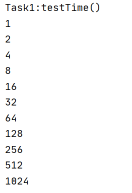
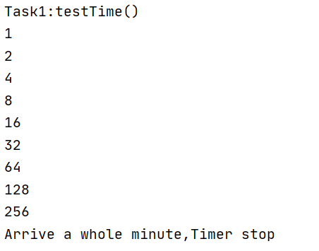
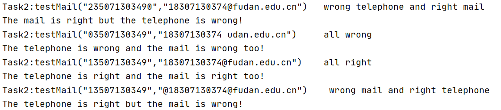
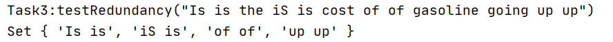
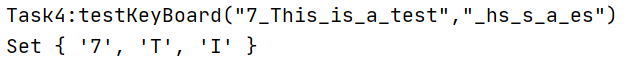
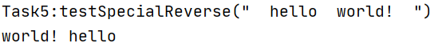
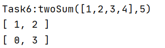
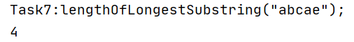
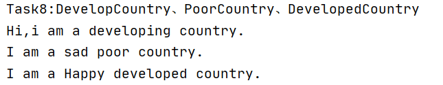
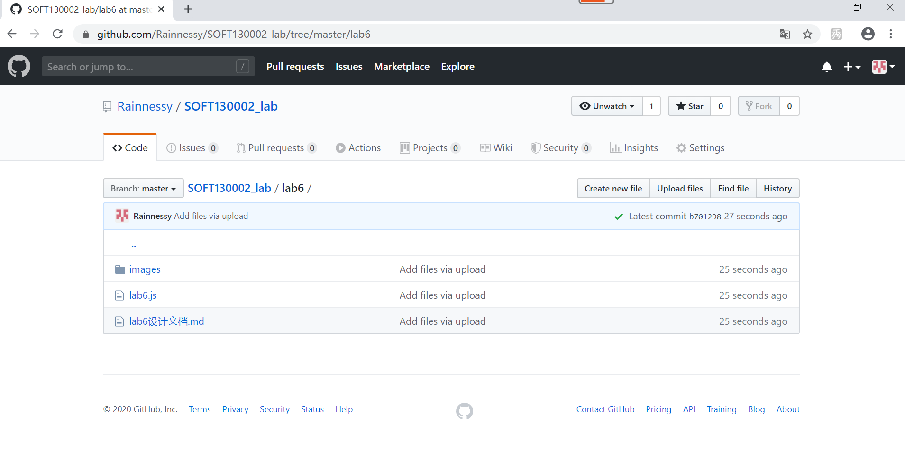

## Lab6设计文档
18307130374 陶雨馨
***
#####测试函数test：
     因为Task1：testTime是个延时函数，所以把他放在最后让它慢慢执行
     Task2测试了四种情况
     其余函数按顺序，并会打印出执行函数及其参数
#####Task1:
     计数变量仅在function testTime中声明为函数内局部变量

#####Task2:
    根据搜索：邮箱由“用户名@主机名.域名构成"其中用户名由数字、字母、下划线组成(此时用一个\w+)就可以解
    决了主机名由数字、字母、下划线组成(又用一个\w+结束),域名却由.数字、字母、下划线构成,此时用\.\w+
    结束了，但是域名例如.edu.cn可能有两个，所以需要把\.\w+括起来,再用一个^$标记字符串的开始结束

#####Task3:
     匹配的正则表达式：pattern = /\b([a-z]+) \1\b/gi
     其中\b确保匹配的两个项均为单词，将([a-z]+)括起来匹配某个单词,\1就匹配匹配到的单词，使用g是为了
     确保匹配项全部被收入其中，否则匹配到第一次就结束，i就是区分大小写

#####Task4:
    这道题比较简单，考虑将wantinput作为循环测试条件，因为它比较长，然后将没有的字符大写添加到set集合
    中，然后Set会把添加的重复元素给去掉就完成了，如果字符有的话就跳过了

#####Task5:
        Step1:字符串的trim方法消去字符串两边的空格
        Step2:字符串的split(参数)方法是根据参数，将字符串分隔为数组，返回值数组，创建变量将其记录
        Step3:reverse方法可以直接返回字符串
        Step4:经过调试，发现有两个空格时，会产生一个空字符串，运用Array类的filter方法，因为filter
              是返回条件为true的项组成数组，而空字符串就是false，所以直接返回item
        Step5:Array类有特有的转换方法join，刚好接受的参数就是分隔符，所以直接传入‘ ’调用join方法
              结束

#####Task6:
    这道题就是使用map其中键为当前位置的值与target的差，值就是当前位置，如果之后查找到了键，说明存在两
    个位置和为target就直接输出即可。

#####Task7:
    因为是不重复子串，所以map中需要记录的就是当前重复字符的上次出现的位置，如果没有位置的话，当前字符
    和字符长度正常后移，同时更新最大长度。如果有位置的话，如果位置超过了开始计算字符串的位置，则更新位
    置以及字符串长度

#####Task8:
    Object.create(对象，添加新属性)：创建一个Country的副本，但是引用类型的属性会共享值，相当于是
                                    一个实例
    原型链继承：就是将父对象变成子类的prototype，子对象可以指向父对象，引用类型同上会共享
    构造函数：可以向父类型传递参数，缺点是每个实例属性都有一个副本

#####Array & Set & Map
    Array:功能强大，传统的数组、栈队列、转化字符串都可以
    Set:主要是值不重复，可以向其中添加删除，访问值
    Map:键值对，访问键获得value
####其余功能性问题已经在Task中说明了
***
###github截图

     
